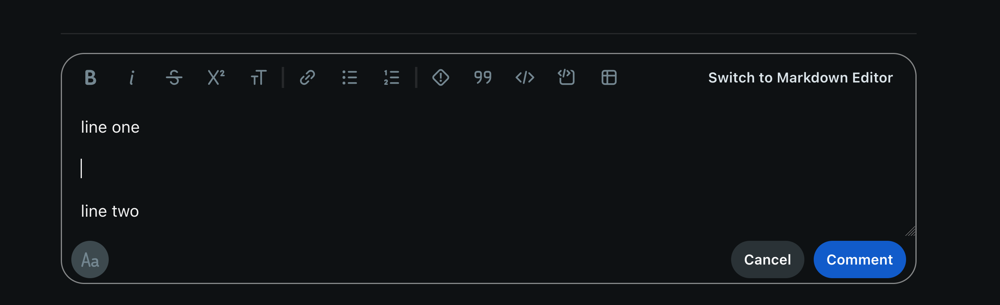
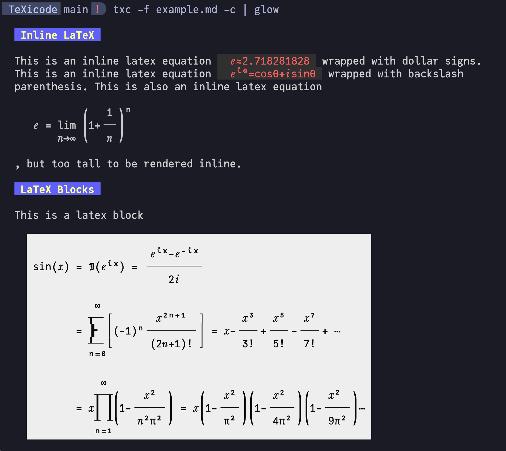

TeXicode, short for TeX to Unicode, a CLI that turns TeX math expressions into Unicode art.

# [Webapp](https://texicode.dx512.com)

Post math in Reddit/Discord/Teams or anywhere that supports code blocks. No more LaTeX screenshots or markdown exponents that don't work. Also useful for inserting single line equations into literally any text field.

<details>
<summary>Quick tutorial for Reddit</summary>

1. Visit the [TeXicode website](https://texicode.dx512.com), copy output to clipboard
1. Make a new line in Reddit text field (check line spacing, if there is no line spacing above and below the cursor, it means Reddit does not see it as a separate line)

1. Add code block

1. Paste

If the output from TeXicode is a single line, can be placed inline using `Code` instead of `Code Block`
</details>


# CLI

### Install

```bash
pipx install TeXicode
```

### Basic Usage

- `txc '\LaTeX'` to output Unicode art
    - wrap TeX equation inside ***single*** quotes
    - escape expression like `f'(x)`, with `f\'(x)`
    - `\[ \]`, `\( \)`, `$ $`, `$$ $$`, `\begin{...} \end{...}` is optional
- `-h` show help message and exit
- `-d` enable debug
- `-f  <FILE>` input Markdown file, see more [below](#Rendering-Math-in-Markdown)
- `-c` enable color (black on white)
- `-n` use normal font instead of serif
- unsupported commands will be rendered as `?`, or raise an error. If you see these or other rendering flaws, please post an issue, most can be easily fixed.

### Rendering Math in Markdown

- `txc -f filename.md` to replace TeX expressions in markdown files with Unicode art in text blocks.
- pipe into a markdown renderer like [glow](https://github.com/charmbracelet/glow) for ultimate terminal markdown preview:

Here is [example.md](example.md) rendered with `txc -f example.md -c | glow`, in the [JuliaMono](https://juliamono.netlify.app/) font.



# Features

- supports most LaTeX math commands
- uses Unicode
    - not limited to ASCII characters
    - Unicode italic glyphs are used to differentiate functions from letters, similar to LaTeX
- works with any good terminal font
    - does not use any legacy glyphs
    - go to `src/arts.py`, comment/uncomment some parts if your font support legacy glyphs to get even better symbols (actually you can't do that no more i removed the comments...)

<!--

# Design Principles

- Use box drawing characters for drawing lines and boxes
    - supported in almost all terminal fonts
    - consistent spacing between lines
    - fine tune length with half length glyphs
- Horizon (center line)
    - makes long concatenated expression readable
    - vertical horizon for &= aligning
    - space saving square roots kinda goes against this, might fix later when I find a better way to draw square roots (found it!)
- Clarity over aesthetics
    - the square root tail is lengthened for clarity
    - all glyphs must connect, sums, square roots, etc
- Fully utilize Unicode features, expressions should look as good as the possibly can

# TODO

- toggled font/artstyle/glyph/legacy/asciimode
- CJK
- get vectors and matrices working
    - better \begin parsing logic
- Better web input field
    - x button
    - code mirror
- comment with %
- macro expansion
- displaystyle, small summation
- better error, consistent with LaTeX
- overline
    - like sqrt, use accent if single char, box drawing if not
- math mode in \text
- \bm \boldsymbol (easy)
- big square root with multi line degree
    - with concat and lower
- delimiters
    - tall angle brackets
    - \middle
- turn it into a vim plugin

-->
